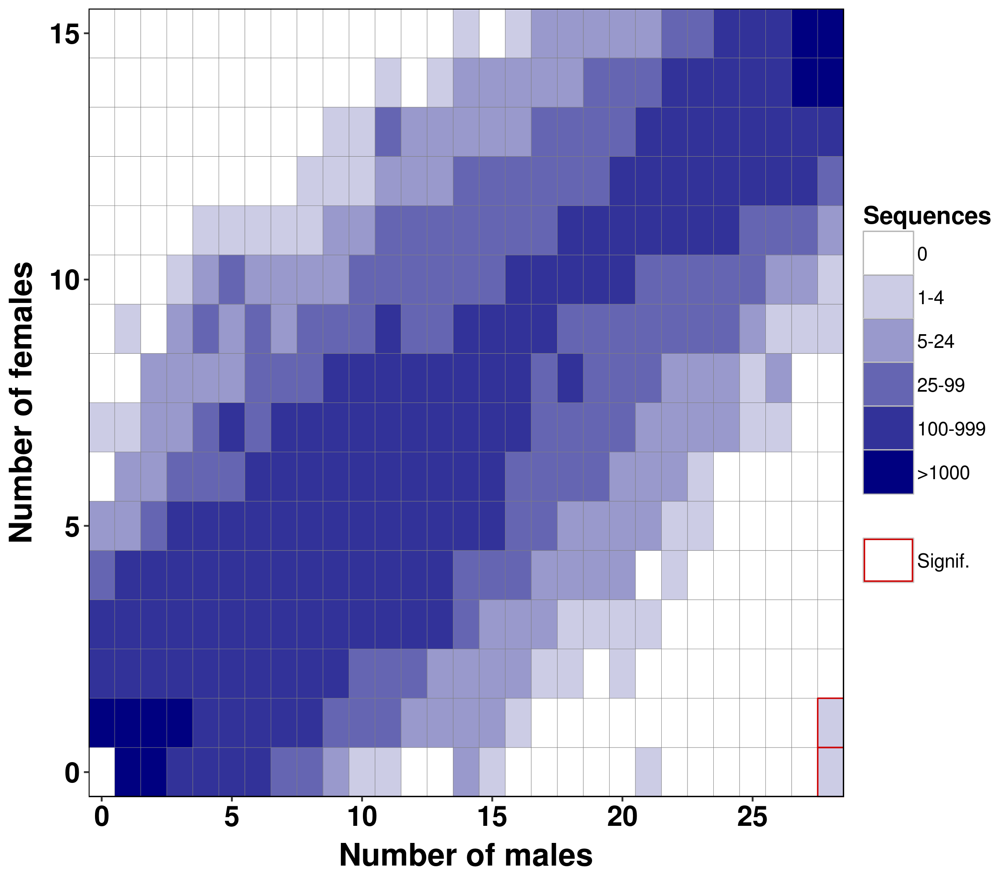
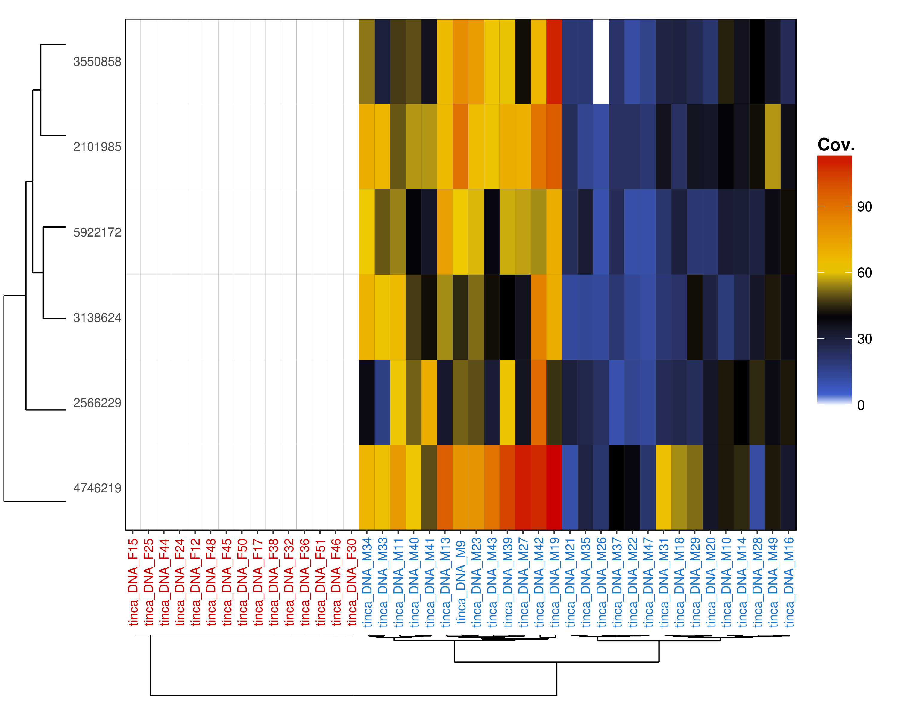
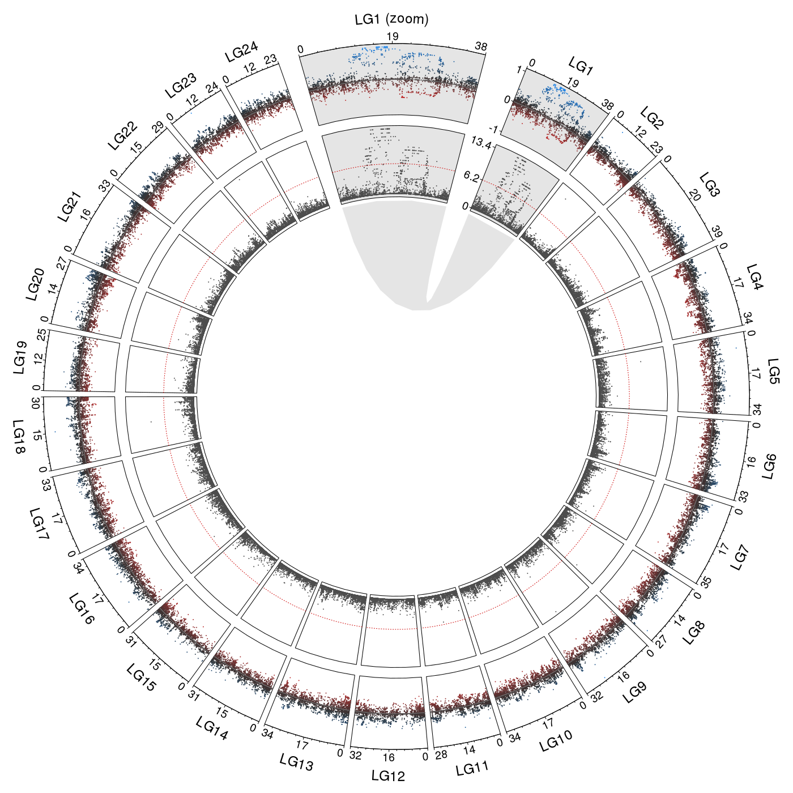
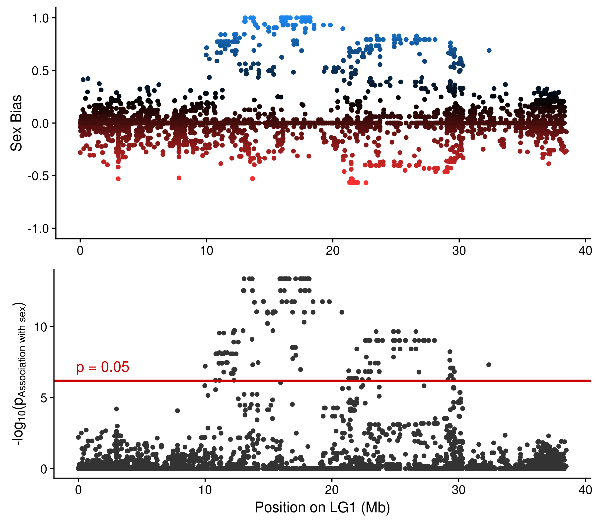

# radsex-vis

The `radsex-vis` R package is **currently under development** and has not been officially released yet. Missing features are been implemented, and some bugs are to be expected in this current development version. Please contact me by email or on Github, or open an issue if you encounter bugs or would like to discuss a feature !

## Overview

The `radsex-vis` R package was developed to visualize results from the [RADsex pipeline](https://github.com/INRA-LPGP/RadSex). For each RADSex command, there is a corresponding function in `radsex-vis` to easily generate a plot from the results file of RADSex. For each analysis, the general organisation of `radsex-vis` is as follows:

- A function to directly plot the results file, for instance, `plot_sex_distribution()`. This is the function you should use most of the time, and its name always starts with *plot*.
- A function to load data from a specific results file, for instance `load_sex_distribution_table()`. This function's name always starts with *load*.
- A function to generate a plot from a results file loaded in R, for instance `sex_distribution_heatmap()`.

The *plot* functions are meant to be easy to use while still offering in-depth customization if desired. Other functions can be used by experienced R users who would like more control over the plotting steps.

This package was developed for the PhyloSex project, which investigates sex determining factors in a wide range of fish species.

## Requirements

- The package was developed and tested in R version 3.4.4.

## Installation

We may try to get `radsex-vis` on CRAN in the future; in the meantime, `radsex-vis` can be installed with devtools by using the following commands in R:

```R
install.packages("devtools")
library(devtools)
devtools::install_github("INRA-LPGP/radsex-vis")
```

## Quick guide

All functions are documented and the detailed usage for each function is available in R with `?function_name`, for instance `?plot_sex_distribution` (or `?radsexvis::plot_sex_distribution` if the package was not loaded). Below is a summary of the main functions:

Function                | Description
----------------------- | ------------
`plot_sex_distribution` | Generates a sex distribution heatmap from the results of RADSex `distrib`
`plot_coverage`         | Generates a coverage heatmap from the results of RADSex `subset`, `signif`, or `loci`.
`plot_genome`           | Generates a whole genome circular plot from the results of RADSex `map`.
`plot_scaffold`         | Generates a linear plot for the specified scaffold from the results of RADSex `map`.

## Examples of results

### Sex distribution



### Coverage



### Whole genome mapping



### Scaffold mapping



## LICENSE

Copyright (C) 2018 Romain Feron and INRA LPGP

This program is free software: you can redistribute it and/or modify it under the terms of the GNU General Public License as published by the Free Software Foundation, either version 3 of the License, or (at your option) any later version.

This program is distributed in the hope that it will be useful, but WITHOUT ANY WARRANTY; without even the implied warranty of MERCHANTABILITY or FITNESS FOR A PARTICULAR PURPOSE. See the GNU General Public License for more details.

You should have received a copy of the GNU General Public License along with this program. If not, see https://www.gnu.org/licenses/
